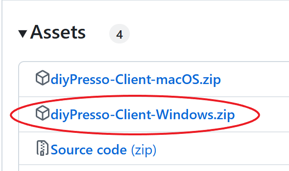
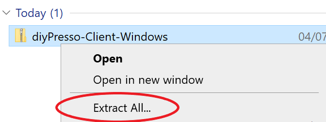
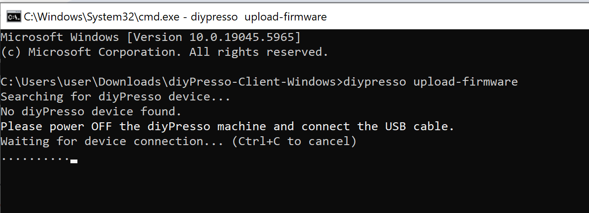
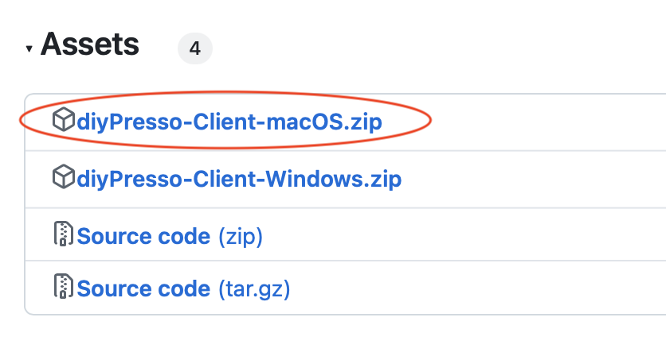
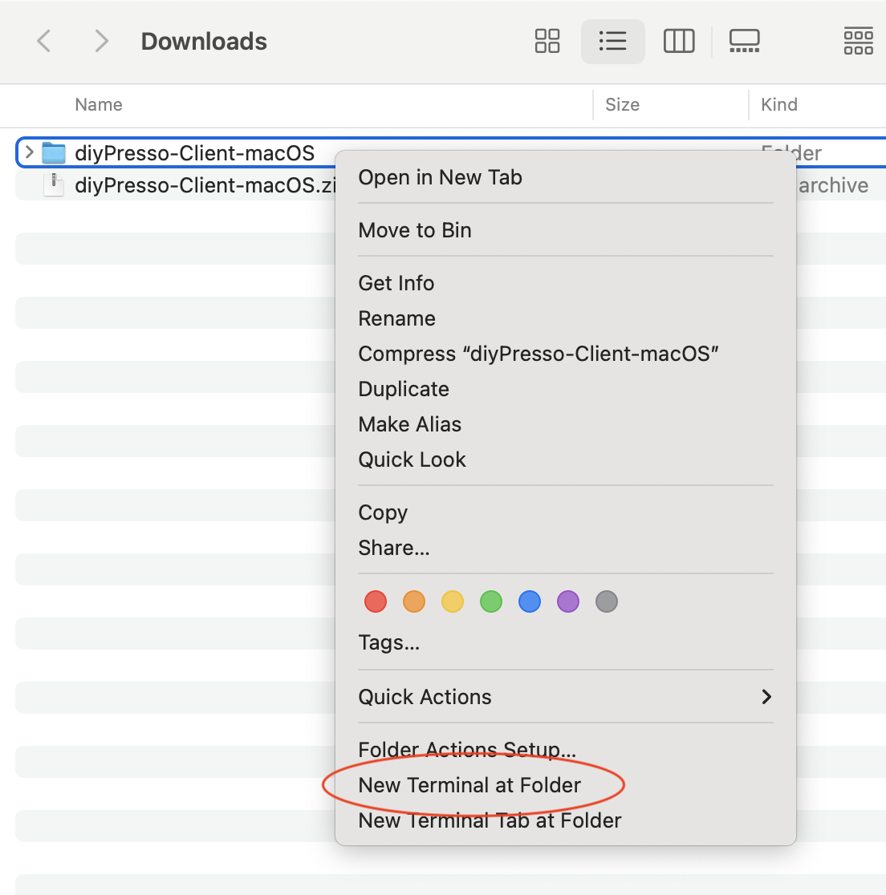
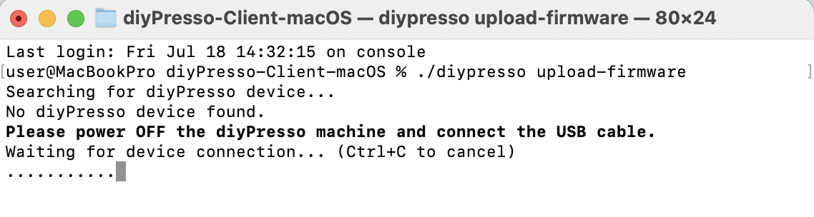

# diyPresso Client C++

C++ management client for diyPresso espresso machine. This application provides firmware upload capabilities, settings configuration and serial monitoring for Arduino MKR WiFi 1010 in the diyPresso machine.


#
## 🖥️ Windows User Guide - Firmware Update

**How to update the firmware of your diyPresso machine on Windows:**

1. **Download the management client with new firmware**
   - Go to the [release page](https://github.com/diyPresso/diyPresso-Client/releases/latest) of this github repository.
   - Click **diyPresso-Client-Windows.zip** to download it.
   
     

2. **Extract the files**
   - Open your **Downloads** folder.
   - Right-click `diyPresso-Client-Windows.zip` → choose **Extract All...** and click **Extract**.
   
   

3. **Open the extracted folder**
   - Double-click the new `diyPresso-Client-Windows` folder to open it if it does not open automatically.  

4. **Open Command Prompt in this folder**
   - Click the folder's address bar (top of the window).
   - Type `cmd` and press **Enter**.
   
   

5. **Turn of your diyPresso machine**
   - Make sure your diyPresso machine is **fully turned off**.
   - Do **not** connect the USB cable yet.

6. **Start the Firmware Upload**
   - In the Command Prompt window, type the command below and press **Enter**:
     ```
     diypresso upload-firmware
     ```
   
   

7. **Connect the USB Cable**
   - The tool will first download the latest firmware from GitHub automatically.
   - When prompted for device connection, plug the USB cable into your diyPresso machine and your computer.
   - The firmware upload will start automatically. Watch the messages in the Command Prompt.

9. **Final Steps**
   - Unplug the USB cable.
   - Turn on your diyPresso nachine and enjoy your upgraded coffee!

> **Tip:** If you see "Device not found," make sure the diyPresso is fully powered off before connecting the USB cable.


## 🍎 macOS User Guide - Firmware Update

**How to update the firmware of your diyPresso machine on macOS:**

1. **Download the management client with new firmware**
   - Go to the [release page](https://github.com/diyPresso/diyPresso-Client/releases/latest) of this github repository.
   - Click **diyPresso-Client-macOS.zip** to download it.

   

2. **Extract the files**
   - Open your **Downloads** folder.
   - Double-click `diyPresso-Client-macOS.zip` to extract it automatically using Archive Utility.

3. **Open Terminal at this folder**
   - **Right-click** the newly created folder and select **New Terminal at Folder**.
   - Alternatively, open Terminal and drag the folder into the Terminal window to navigate to it.

   

4. **Turn off your diyPresso machine**
   - Make sure your diyPresso machine is **fully turned off**.
   - Do **not** connect the USB cable yet.

5. **Start the Firmware Upload**
   - In the Terminal window, type the command below and press **Enter**:
     ```
     ./diypresso upload-firmware
     ```

   

6. **Connect the USB Cable**
   - The tool will first download the latest firmware from GitHub automatically.
   - When prompted for device connection, plug the USB cable into your diyPresso machine and your computer.
   - The firmware upload will start automatically. Watch the messages in the Terminal.

7. **Final Steps**
   - Unplug the USB cable.
   - Turn on your diyPresso machine and enjoy your upgraded coffee!

> **Tip:** If you see "Device not found," make sure the diyPresso is fully powered off before connecting the USB cable. On macOS, you may need to grant Terminal permission to access USB devices if prompted.


# 🎪 Other Usage Examples

```bash
# Device information
./diypresso info

# Monitor raw serial output
./diypresso monitor

# Settings management
./diypresso get-settings
./diypresso restore-settings --settings-file backup.json

# Firmware upload (automatically downloads latest firmware)
./diypresso upload-firmware                          # Download latest + upload
./diypresso upload-firmware --version=v1.7.0         # Download specific version + upload
./diypresso upload-firmware --binary-url=https://example.com/firmware.bin  # Custom URL + upload
./diypresso upload-firmware -b firmware.bin          # Skip download, use local file

# Firmware download and information
./diypresso download                                 # Download latest firmware
./diypresso download --version=v1.7.0                # Download specific version
./diypresso download --check                         # Check latest version info
./diypresso download --check --version=v1.6.2        # Check specific version info
./diypresso download --list-versions                 # List all available versions
```


### Platform Support
- **macOS 13+** (Apple Silicon and Intel)
- **Windows 10/11** (x64 and x86)


## 🏛️ Architecture Overview

The application follows a **device-centric architecture** with clear ownership and service patterns:

```
┌─────────────────────────────────────────────────────────────┐
│                    CLI Interface Layer                      │
│                      (main.cpp)                            │
│  ┌─────────────┐ ┌─────────────┐ ┌─────────────┐ ┌────────┐ │
│  │   monitor   │ │get-settings │ │upload-firmware│ │ info │ │
│  │    help     │ │restore-sett │ │   download  │ │      │ │
│  └─────────────┘ └─────────────┘ └─────────────┘ └────────┘ │
└─────────────────────────────────────────────────────────────┘
                              │
                              ▼
┌─────────────────────────────────────────────────────────────┐
│                  Device-Centric Core                       │
│  ┌─────────────────────────────────────────────────────┐    │
│  │                  DpcDevice                         │    │
│  │                (Central Hub)                       │    │
│  │  ┌─────────────────────────────────────────────┐   │    │
│  │  │              DpcSerial                      │   │    │
│  │  │           (Owned Instance)                  │   │    │
│  │  │  • USB detection  • Serial I/O             │   │    │
│  │  │  • libusbp enum   • Native Win/macOS API    │   │    │
│  │  │  • port mgmt      • protocol handling      │   │    │
│  │  └─────────────────────────────────────────────┘   │    │
│  │                                                     │    │
│  │  • Device state & lifecycle                        │    │
│  │  • Connection management                           │    │
│  │  • Command/response protocol                       │    │
│  │  • Bootloader operations                           │    │
│  │  • Device information                              │    │
│  └─────────────────────────────────────────────────────┘    │
│                              │                              │
│                              ▼                              │
│  ┌─────────────────┐  ┌─────────────────┐  ┌──────────────┐ │
│  │  DpcSettings    │  │  DpcFirmware    │  │  DpcDownload │ │
│  │   (Service)     │  │   (Service)     │  │  (Service)   │ │
│  │                 │  │                 │  │              │ │
│  │ • get_settings  │  │ • upload        │  │ • download   │ │
│  │ • put_settings  │  │ • bossac        │  │ • GitHub API │ │
│  │ • save_to_file  │  │ • validation    │  │ • progress   │ │
│  │ • load_from_file│  │ • workflow      │  │ • validation │ │
│  │ • validation    │  │ • safety checks │  │ • backup     │ │
│  └─────────────────┘  └─────────────────┘  └──────────────┘ │
│         │                      │                   │        │
│         └──────────────────────┼───────────────────┘        │
│                                ▼                            │
│              Operates on DpcDevice reference                │
└─────────────────────────────────────────────────────────────┘
                              │
                              ▼
┌─────────────────────────────────────────────────────────────┐
│                   Hardware Layer                           │
│                  Arduino MKR WiFi 1010                     │
│              (diyPresso espresso controller)               │
│                   VID: 9025, PID: 32852/84                │
└─────────────────────────────────────────────────────────────┘
```

### **Key Architecture Principles:**

- **🎯 Single Device Instance** - One DpcDevice per command execution
- **🏠 Clear Ownership** - DpcDevice owns the DpcSerial connection  
- **⚙️ Service Pattern** - DpcSettings and DpcFirmware operate on device
- **🔄 Lifecycle Management** - Device handles connection state
- **🛡️ Encapsulation** - Serial details hidden behind device interface

## 📁 Project Structure

```
diyPresso-Client-cpp/
├── README.md                 # This file
├── CMakeLists.txt           # Build configuration
├── c_cpp_properties.json    # VS Code C++ configuration
│
├── src/                     # Source code
│   ├── main.cpp             # ✅ CLI interface & command routing
│   ├── DpcSerial.h/.cpp     # ✅ Serial communication layer
│   ├── DpcDevice.h/.cpp     # ✅ Device state & operations
│   ├── DpcSettings.h/.cpp   # ✅ Settings management
│   ├── DpcFirmware.h/.cpp   # ✅ Firmware upload & bootloader
│   └── DpcDownload.h/.cpp   # ✅ Firmware download from GitHub
│
├── bin/                     # Binaries and tools
│   ├── firmware/            # Firmware binary files
│   └── bossac/              # bossac tool for firmware upload
│
├── python-src/              # Reference Python implementation
│   ├── diyPresso/           # Python modules
│   └── diyPresso-cli/       # Python CLI application
│
├── build/                   # Build artifacts (generated)
└── external/                # External dependencies
```

Legend: ✅ Implemented | 🔲 Planned

## 🔧 Class Responsibilities

### **DpcSerial** - Serial Communication Layer
**Status:** ✅ Implemented

Handles low-level USB and serial communication:
- USB device enumeration using libusbp
- Serial port management with native platform APIs (Windows/macOS)
- Device detection (Arduino MKR WiFi 1010)
- Raw read/write operations


### **DpcDevice** - Device State & Operations
**Status:** ✅ Implemented

Manages device connection and basic operations:
- Device discovery and connection management
- Firmware version detection
- Serial monitoring (raw output)
- Command/response protocol handling


### **DpcSettings** - Settings Management
**Status:** ✅ Implemented

Handles all settings-related operations:
- GET/PUT settings protocol implementation
- JSON file serialization/deserialization
- Settings validation, backup and restore

### **DpcFirmware** - Firmware Upload & Bootloader
**Status:** ✅ Implemented

Manages firmware upload and bootloader operations:
- Automatic firmware download integration (downloads latest by default)
- Bootloader reset (1200 baud trick)
- bossac integration for firmware upload
- Complete update workflow with settings backup/restore
- Firmware validation

### **DpcDownload** - Firmware Download & Information
**Status:** ✅ Implemented

Handles firmware downloading and version management from GitHub:
- Download latest firmware from GitHub releases
- Download specific versions by tag
- Custom URL support for alternative firmware sources
- Progress indication and file validation
- Automatic backup of existing firmware
- Version information checking (latest or specific versions)
- List all available firmware versions with release dates


## 🚀 Building

### Windows
See [WINDOWS_SETUP.md](WINDOWS_SETUP.md) for detailed Windows build instructions.

**Quick start:**
```cmd
# Run the automated build script
build-windows.bat
```

### macOS
1. **Install dependencies via vcpkg:**
   ```bash
   vcpkg install libusbp nlohmann-json cli11
   ```

2. **Build universal binary (ARM + Intel):**
   ```bash
   ./build-macos.sh
   ```
   
   This creates a binary that works on both Apple Silicon and Intel Macs.

3. **Run:**
   ```bash
   ./build/diypresso info
   ```


## 🚧 TODO

Must:
- [x] **macOS user instructions**

Nice to have:
- [ ] **Remove std::exit() usage** - Replace with proper error handling and return codes throughout codebase
- [ ] **Refactor global state** - Move g_device, g_interrupted, g_verbose into Application/context class for better testability
- [ ] **Extract command logic** - Move CLI command implementations from main.cpp into separate command classes/functions
- [ ] **Standardize error handling** - Use consistent exceptions or error codes across all modules (DpcSettings, DpcFirmware, DpcDevice, main.cpp)
- [ ] **Improve settings validation** - Add required key validation in DpcSettings beyond just count checking
- [ ] **Extract path logic** - Move firmware and bossac path logic in DpcFirmware to reusable utility function/class
- [ ] **Add unit tests** - Create comprehensive tests for DpcSerial, DpcDevice, DpcSettings, and DpcFirmware
- [ ] **Document build process** - Add macOS build and packaging documentation to README


## 📄 License

GNU General Public License v3.0 - see the [LICENSE](LICENSE) file for details.

---

*diyPresso Client C++ - Modern device management for espresso enthusiasts* ☕ 